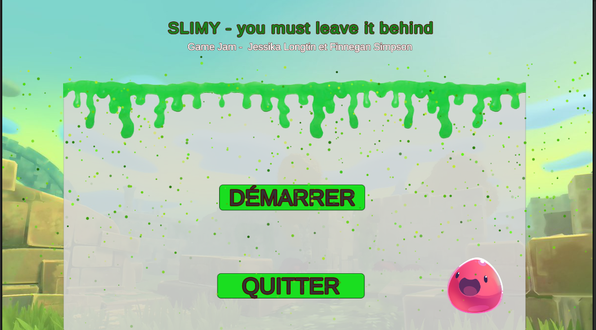
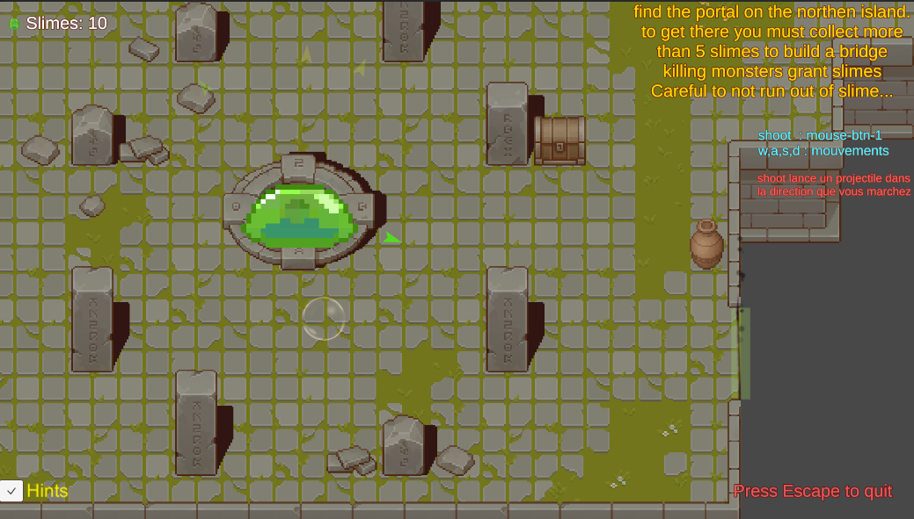
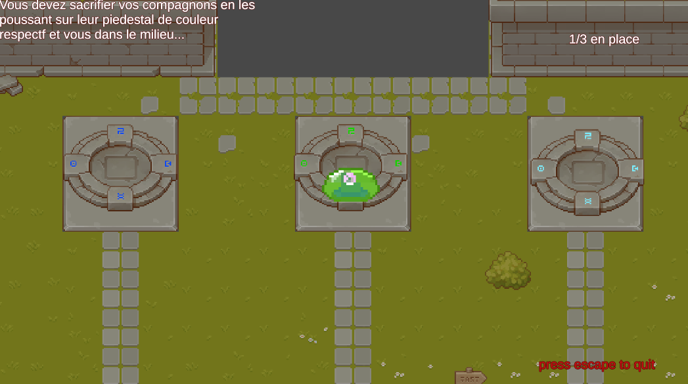
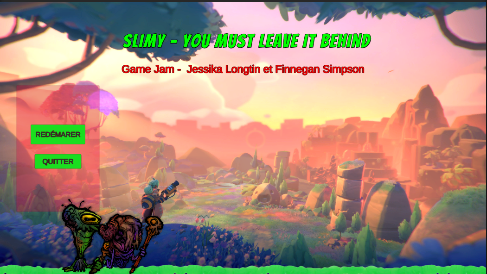

<a name="readme-top"></a>

<br />
<div align="center">


<h3 align="center">Slimy, you must leave it behind</h3>

  <p align="center">
    Game jam style project in he them : you must leave it behind 
    <br />
    
  </p>
</div>


<!-- TABLE OF CONTENTS -->
<details>
  <summary>Table of Contents</summary>
  <ol>
    <li>
      <a href="#about-the-project">About The Project</a>
      <ul>
        <li><a href="#built-with">Built With</a></li>
      </ul>
    </li>
    <li>
      <a href="#getting-started">Getting Started</a>
      <ul>
        <li><a href="#prerequisites">Prerequisites</a></li>
        <li><a href="#installation">Installation</a></li>
      </ul>
    </li>
    <li><a href="#usage">Usage</a></li>
    <li><a href="#contact">Contact</a></li>
  </ol>
</details>


<!-- ABOUT THE PROJECT -->
## About The Project


Final projet for our video game course.  The theme was "you must leave it behind". We made a game where you play as a slime that has to leave behind its body parts to get to the end of the level.

<p align="right">(<a href="#readme-top">back to top</a>)</p>


### Built With


<p align="right">(<a href="#readme-top">back to top</a>)</p>


<!-- GETTING STARTED -->
## Getting Started
You can download the project and open it in Unity to play the game. You can also download the build folder and run the .exe file to play the game.

### Prerequisites

* Unity
  ```sh
  https://unity.com/
  ```
* Visual Studio
  ```sh
  https://visualstudio.microsoft.com/
  ```


### Installation

1. Clone the repo
   ```sh
   git clone https://github.com/jslongtin/DDJV_Slimy.git
   ```
2. Open the project in Unity


<p align="right">(<a href="#readme-top">back to top</a>)</p>


<!-- USAGE EXAMPLES -->
## Usage



The game starts with a home screen to sart the game or quit the application. When the game starts, you play as a slime that has to leave behind its body parts to unlock bridges , shoot enemies or take damage. The goal is to get to the end of the level without dying and collecting slimes. 


The second level , you have to find two other slime characters and sacrifice them on altars finish the game. You end up on the end screen where you can restart the game or quit the application.




<!-- CONTACT -->
## Contact

Jessika Longtin : [Github](https://github.com/jslongtin)
<br>
Finnegan Simpson : [Github](https://github.com/Finnlandish)

Project Link: [https://github.com/jslongtin/DDJV_Slimy](https://github.com/jslongtin/DDJV_Slimy)

<p align="right">(<a href="#readme-top">back to top</a>)</p>

